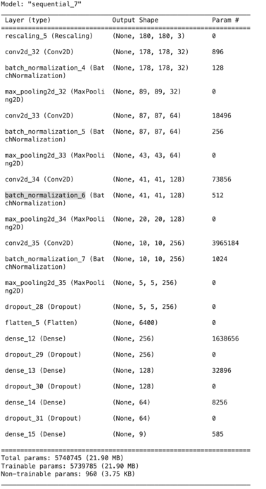
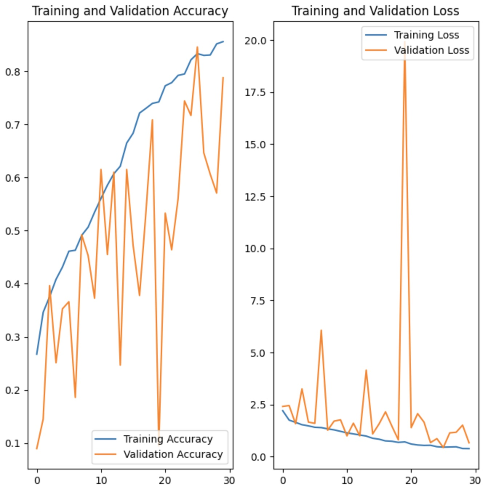

# Melanoma Detection Assignment

- This assignment is to build a CNN based model to detect melanoma.

## Table of Contents

* [General Information](#general-information)
* [Technologies Used](#technologies-used)
* [Architecture](#architecture)
* [Conclusions](#conclusions)
* [Contact](#contact)

<!-- You can include any other section that is pertinent to your problem -->

## General Information

> **Problem statement**: To build a CNN based model which can accurately detect melanoma. Melanoma is a type of cancer that can be deadly if not detected early. It accounts for 75% of skin cancer deaths. A solution that can evaluate images and alert dermatologists about the presence of melanoma has the potential to reduce a lot of manual effort needed in diagnosis.

> The dataset consists of 2357 images of malignant and benign oncological diseases, which were formed from the **International Skin Imaging Collaboration (ISIC)**. All images were sorted according to the classification taken with ISIC, and all subsets were divided into the same number of images, with the exception of melanomas and moles, whose images are slightly dominant.

> In this assignment, we will build a **multiclass classification model using a custom convolutional neural network in TensorFlow**.

##### Data Summary:

The data set contains the following diseases:

- Actinic keratosis
- Basal cell carcinoma
- Dermatofibroma
- Melanoma
- Nevus
- Pigmented benign keratosis
- Seborrheic keratosis
- Squamous cell carcinoma
- Vascular lesion

<!-- You don't have to answer all the questions - just the ones relevant to your project. -->

## Technologies Used

<!-- As the libraries versions keep on changing, it is recommended to mention the version of library used in this project -->

## Architecture

### Layer's Used

- Rescalling Layer
- Convolutional Layer
- Batch Normalization
- Pooling Layer
- Dropout Layer
- Flatten Layer
- Activation Function(ReLU)
- Activation Function(Softmax)

### Model Evaluation

## Conclusions

- Without **augmentation** and **class re-balance** the models performs
    - training accuracy - 55%,
    - validation accuracy - 49.5%
    - epochs - 20
- With **augmentation** the model performs
    - training accuracy - 47%,
    - validation accuracy - 44%
    - epochs - 20
- With **augmentation**, **class re-balance** and **batch normalization** the models performs
    - training accuracy - 84%,
    - validation accuracy - 79%
    - epochs - 30

<!-- You don't have to answer all the questions - just the ones relevant to your project. -->

## Contact

Created by [@sanjayakumarsahoo] - feel free to contact me!

<!-- Optional -->
<!-- ## License -->
<!-- This project is open source and available under the [... License](). -->

<!-- You don't have to include all sections - just the one's relevant to your project -->